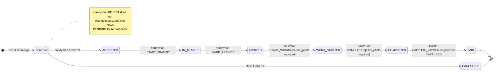

# Booking State Machine Specification

Authoritative reference for the Oki handyman marketplace booking lifecycle. All status changes MUST go through the state-machine RPC (`PATCH /bookings/:id/state` or equivalent); direct `UPDATE bookings.status` is forbidden for client/handyman roles.

**Related:** [`database-architecture.md`](./database-architecture.md) (schema, RLS, `booking_events` audit table)

---

## States

| DB enum (`booking_status`) | App enum (`BookingStatus`) | Terminal | Description                                                              |
| -------------------------- | -------------------------- | -------- | ------------------------------------------------------------------------ |
| `PENDING`                  | `Pending`                  | No       | Booking created; payment authorized (hold); awaiting handyman assignment |
| `ACCEPTED`                 | `Accepted`                 | No       | Handyman assigned; job scheduled or ready for dispatch                   |
| `IN_TRANSIT`               | `InTransit`                | No       | Handyman en route; live location published to client                     |
| `ARRIVED`                  | `Arrived`                  | No       | Handyman at job site (manual confirm or geofence-assisted)               |
| `WORK_STARTED`             | `WorkStarted`              | No       | Work in progress; before-photo captured                                  |
| `COMPLETED`                | `Completed`                | No       | Work finished; after-photo captured; awaiting payment capture            |
| `PAID`                     | `Paid`                     | **Yes**  | Escrow captured; handyman wallet credited; reviews unlocked              |
| `CANCELLED`                | `Cancelled`                | **Yes**  | Client cancelled pre-acceptance, or auth failed; hold released           |

### Happy-path sequence

```
PENDING → ACCEPTED → IN_TRANSIT → ARRIVED → WORK_STARTED → COMPLETED → PAID
```

### Side exit

```
PENDING → CANCELLED   (client-initiated cancel, or payment authorization failure)
```

---

## State diagram



---

## Valid transitions & guard conditions

Each successful transition MUST:

1. Validate actor role and booking ownership
2. Evaluate all guards below
3. Update `bookings.status` and `bookings.updated_at`
4. Insert one immutable row into `booking_events` (`from_status`, `to_status`, `actor_id`, `metadata`)

| From           | To             | Action          | Actor                                    | Guards                                                                                                                                                                                                                                                        |
| -------------- | -------------- | --------------- | ---------------------------------------- | ------------------------------------------------------------------------------------------------------------------------------------------------------------------------------------------------------------------------------------------------------------- |
| `PENDING`      | `ACCEPTED`     | `ACCEPT`        | Handyman                                 | Booking is `PENDING`; handyman `is_online = true`; `kyc_status = APPROVED`; handyman offers booking's service category; `handyman_id` set to accepting handyman; `payments.status = AUTHORIZED`; booking not expired (`request_expires_at` null or in future) |
| `PENDING`      | `CANCELLED`    | `CANCEL`        | Client                                   | Booking is `PENDING`; caller is `client_id`; release payment authorization hold                                                                                                                                                                               |
| `ACCEPTED`     | `IN_TRANSIT`   | `START_TRANSIT` | Handyman                                 | Caller is assigned `handyman_id`; booking is `ACCEPTED`; for `SCHEDULED` bookings, `scheduled_at` within allowed window (≥ 15 min before slot, configurable)                                                                                                  |
| `IN_TRANSIT`   | `ARRIVED`      | `MARK_ARRIVED`  | Handyman                                 | Caller is assigned `handyman_id`; booking is `IN_TRANSIT`; **recommended:** handyman location within 200 m of `bookings.location` (`ST_DWithin`, default radius) — API may warn but still allow manual confirm if geofence fails                              |
| `ARRIVED`      | `WORK_STARTED` | `START_WORK`    | Handyman                                 | Caller is assigned `handyman_id`; booking is `ARRIVED`; **`before_photo_url` IS NOT NULL** (photo uploaded to private storage before transition)                                                                                                              |
| `WORK_STARTED` | `COMPLETED`    | `COMPLETE`      | Handyman                                 | Caller is assigned `handyman_id`; booking is `WORK_STARTED`; **`after_photo_url` IS NOT NULL**                                                                                                                                                                |
| `COMPLETED`    | `PAID`         | _(automatic)_   | System (payment webhook / Edge Function) | Booking is `COMPLETED`; **`payments.status = CAPTURED`**; platform fee deducted; handyman wallet credit posted. Triggered after client confirms completion or admin auto-confirm timeout (see escrow flow in `App_Development_Guide.md`)                      |

### Handyman decline (not a state transition)

| Action   | Actor    | Behavior                                                                                                                                                                                          |
| -------- | -------- | ------------------------------------------------------------------------------------------------------------------------------------------------------------------------------------------------- |
| `REJECT` | Handyman | Booking **remains** `PENDING`; record rejection in `booking_events.metadata` (handyman id, reason); clear any tentative assignment; re-broadcast to other handymen. Does **not** use `CANCELLED`. |

### Payment authorization failure (creation-time)

If payment authorization fails during `POST /bookings`, the booking is never created (or is rolled back). If authorization is revoked while `PENDING`, transition to `CANCELLED` via system actor with `metadata.reason = PAYMENT_AUTH_FAILED`.

---

## Escrow coupling

| Booking status           | Expected `payments.status`                                                                              |
| ------------------------ | ------------------------------------------------------------------------------------------------------- |
| `PENDING` … `COMPLETED`  | `AUTHORIZED` (hold active)                                                                              |
| `PAID`                   | `CAPTURED`                                                                                              |
| `CANCELLED` (pre-accept) | Hold released; payment row may remain `AUTHORIZED` with zero capture or move to `REFUNDED` per provider |

**Hard rule:** A booking MUST NOT enter `PAID` unless it has passed through `COMPLETED` and payment capture succeeded.

---

## API contract

### Endpoint

```
PATCH /bookings/:id/state
Authorization: Bearer <jwt>
Content-Type: application/json
```

### Request body

```json
{
  "action": "ACCEPT | REJECT | CANCEL | START_TRANSIT | MARK_ARRIVED | START_WORK | COMPLETE",
  "metadata": {
    "reason": "optional string",
    "location": { "lat": 14.5995, "lng": 120.9842 }
  }
}
```

Photo uploads use a separate endpoint (e.g. `POST /bookings/:id/photos`) and MUST complete before `START_WORK` / `COMPLETE` actions.

### Success response

`200 OK` — returns updated booking object and latest `booking_events` entry.

---

## Invalid transitions & error responses

Invalid transitions and guard failures return **`422 Unprocessable Entity`** (not `400` or `409`, unless noted).

### Error body schema

```json
{
  "error": "INVALID_STATE_TRANSITION",
  "message": "Human-readable summary",
  "from_status": "PENDING",
  "to_status": "COMPLETED",
  "action": "COMPLETE",
  "reason_code": "TRANSITION_NOT_ALLOWED",
  "details": {}
}
```

| `reason_code`            | When used                                                                                            |
| ------------------------ | ---------------------------------------------------------------------------------------------------- |
| `TRANSITION_NOT_ALLOWED` | Requested `(from_status, to_status)` pair is not in the valid transition table                       |
| `GUARD_NOT_SATISFIED`    | Transition is valid in principle but a precondition failed (photo, payment, role, etc.)              |
| `WRONG_ACTOR`            | Authenticated user is not permitted for this action (also consider `403` for explicit role mismatch) |
| `BOOKING_TERMINAL`       | Booking is already `PAID` or `CANCELLED`                                                             |
| `PAYMENT_NOT_CAPTURED`   | Attempt to reach `PAID` without `payments.status = CAPTURED`                                         |

### Invalid transition matrix (sample)

Any transition not listed in [Valid transitions & guard conditions](#valid-transitions--guard-conditions) is rejected with `reason_code: TRANSITION_NOT_ALLOWED`.

| Attempted transition                      | `reason_code`            | Example `message`                                                                                  |
| ----------------------------------------- | ------------------------ | -------------------------------------------------------------------------------------------------- |
| `PENDING` → `COMPLETED`                   | `TRANSITION_NOT_ALLOWED` | Cannot skip workflow states between PENDING and COMPLETED                                          |
| `PENDING` → `PAID`                        | `TRANSITION_NOT_ALLOWED` | Cannot mark booking paid before completion                                                         |
| `ACCEPTED` → `ARRIVED`                    | `TRANSITION_NOT_ALLOWED` | Must mark in transit before arrival                                                                |
| `IN_TRANSIT` → `WORK_STARTED`             | `TRANSITION_NOT_ALLOWED` | Must mark arrived before starting work                                                             |
| `WORK_STARTED` → `PAID`                   | `TRANSITION_NOT_ALLOWED` | Must complete work before payment settlement                                                       |
| `COMPLETED` → `ACCEPTED`                  | `TRANSITION_NOT_ALLOWED` | Cannot revert to accepted after completion                                                         |
| `PAID` → _any_                            | `BOOKING_TERMINAL`       | Booking is closed                                                                                  |
| `CANCELLED` → _any_                       | `BOOKING_TERMINAL`       | Booking is closed                                                                                  |
| `ACCEPTED` → _any_ (client `CANCEL`)      | `TRANSITION_NOT_ALLOWED` | Client cannot cancel after handyman acceptance; use dispute flow (see Week 21 cancellation policy) |
| `ARRIVED` → `WORK_STARTED` (no photo)     | `GUARD_NOT_SATISFIED`    | Before photo required to start work                                                                |
| `WORK_STARTED` → `COMPLETED` (no photo)   | `GUARD_NOT_SATISFIED`    | After photo required to complete work                                                              |
| `COMPLETED` → `PAID` (auth only)          | `GUARD_NOT_SATISFIED`    | Payment must be captured before PAID                                                               |
| `PENDING` → `ACCEPTED` (offline handyman) | `GUARD_NOT_SATISFIED`    | Handyman must be online to accept                                                                  |
| `PENDING` → `ACCEPTED` (KYC pending)      | `GUARD_NOT_SATISFIED`    | Handyman KYC must be approved                                                                      |

### Example 422 responses

**Skip states**

```http
HTTP/1.1 422 Unprocessable Entity
Content-Type: application/json

{
  "error": "INVALID_STATE_TRANSITION",
  "message": "Cannot transition from PENDING to COMPLETED",
  "from_status": "PENDING",
  "to_status": "COMPLETED",
  "action": "COMPLETE",
  "reason_code": "TRANSITION_NOT_ALLOWED"
}
```

**Missing before photo**

```http
HTTP/1.1 422 Unprocessable Entity
Content-Type: application/json

{
  "error": "INVALID_STATE_TRANSITION",
  "message": "Upload a before photo before starting work",
  "from_status": "ARRIVED",
  "to_status": "WORK_STARTED",
  "action": "START_WORK",
  "reason_code": "GUARD_NOT_SATISFIED",
  "details": { "missing_field": "before_photo_url" }
}
```

**Post-acceptance client cancel**

```http
HTTP/1.1 422 Unprocessable Entity
Content-Type: application/json

{
  "error": "INVALID_STATE_TRANSITION",
  "message": "Booking cannot be cancelled after a handyman has accepted",
  "from_status": "ACCEPTED",
  "to_status": "CANCELLED",
  "action": "CANCEL",
  "reason_code": "TRANSITION_NOT_ALLOWED"
}
```

---

## Audit log (`booking_events`)

Every transition produces:

| Column        | Value                                                                   |
| ------------- | ----------------------------------------------------------------------- |
| `booking_id`  | Target booking                                                          |
| `actor_id`    | User or null for system                                                 |
| `from_status` | Previous status (null on create)                                        |
| `to_status`   | New status                                                              |
| `metadata`    | JSON: `action`, `reason`, geolocation snapshot, photo URLs, payment ids |

Rows are **immutable** (no UPDATE/DELETE via RLS). Admin dispute view queries by `booking_id` ordered by `created_at ASC`.

---

## Mobile / app mapping

| `BookingStatus` (TypeScript) | DB `booking_status` |
| ---------------------------- | ------------------- |
| `Pending`                    | `PENDING`           |
| `Accepted`                   | `ACCEPTED`          |
| `InTransit`                  | `IN_TRANSIT`        |
| `Arrived`                    | `ARRIVED`           |
| `WorkStarted`                | `WORK_STARTED`      |
| `Completed`                  | `COMPLETED`         |
| `Paid`                       | `PAID`              |
| `Cancelled`                  | `CANCELLED`         |

Handyman workflow CTAs (`src/context/BookingsContext.tsx`) map 1:1 to actions: Accept → Head to job → Mark Arrived → Start Work → Complete Job → _(system)_ Paid.

---

## Implementation checklist (Week 5 / Week 11)

- [x] Document all valid states and terminal states
- [x] Define guard conditions per transition
- [x] Document invalid transitions and `422` error schema
- [x] Publish FSM diagram to shared project docs (this file)

**Next (Phase 2):** Implement FSM service, wire `PATCH /bookings/:id/state`, unit-test all valid/invalid paths, ensure diagram stays in sync with code.
